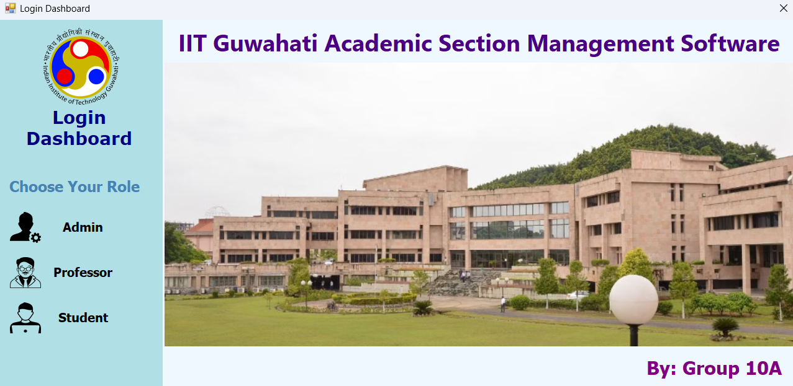
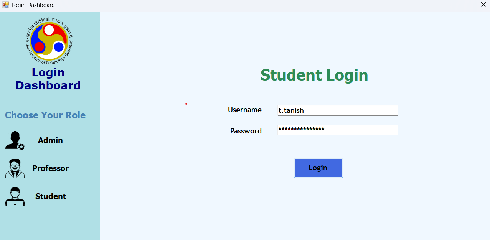
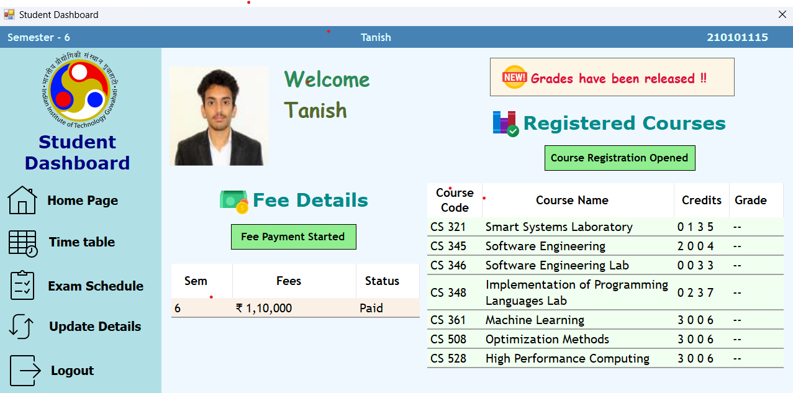
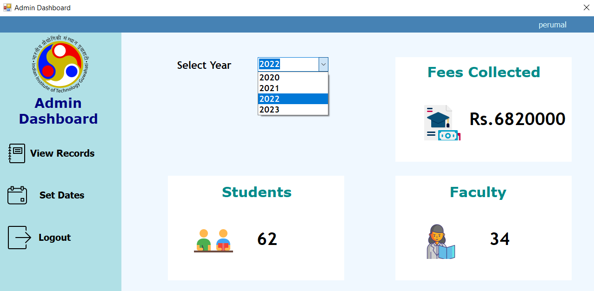
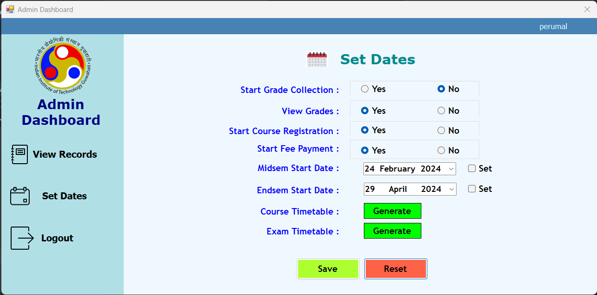

[// ---------------------Log In ----------------------------]: <> 
# Login Screen
This screen appears when user opens the application. Users can login into their respective account through this screen.

## Access Scope
- Any Student currently enrolled in an Undergraduate program of Computer Science and Engineering Department at Indian Institute of Technology, Guwahati
- Faculties, teaching courses to Computer Science students.
- Admin.

## Usage Instructions

- Initially, default login screen will be displayed.

- Then you need to select your role.

- Add your details and click the `Login` button

- You will be redirected to your homepage. Click on `Logout` button to go back to the login screen.

- If details are incorrect/left empty you will get an error message.

  

> **NOTE:** 
Once the login button is clicked, the current form closes and new form ,User dashboard, will be opened. This might take some time.

[// ---------------------Admin View Records ----------------------------]: <> 

# View Admin Records Form
This form allows the Admin to view the records of the students, faculties and fees paid.

## Access Scope : 
Only someone with Admin access can view this form.

## Usage Instructions

- This form will display all the records of the students, faculties and fees paid. Select the `year` from the drop down menu to view the records of that year.

> **NOTE:**  
> The `year` denotes the financial year for which the records are to be viewed. The financial year starts from 1st April and ends on 31st March of the next year.

[// ---------------------Admin Set Dates ----------------------------]: <> 

# Admin Set Dates Screen
This screen allows the admin to start various processes like grade collection, grades viewing, course registration, fee payment. The admin also sets starting date for midsem and endsem, and generates the course timetable and exam timetable.

## Access Scope : 
Only the Admin of Indian Institute of Technology, Guwahati.

## Usage Instructions

- The screen which will load will show the currently selected options.

- Choose Yes from `Start Grade Collection` to start the grade collection procedure.

- Choose Yes from `View Grades` to allow students to view their grades.

- Choose Yes from `Start Course Registration` to enable students to start registering their courses.

- Choose Yes from `Start Fee Payment` to start the fee payment process.

- Choose a date from `Midsem Start Date` and check the Set checkbox to change the midsem start date to the chosen one.

- Choose a date from `Endsem Start Date` and check the Set checkbox to change the endsem start date to the chosen one.

- To generate the course timetable click on Generate from `Course Timetable` option.

- To generate the exam timetable click on Generate from `Exam Timetable` option.

- The admin can make changes and click on save button which will ask for confirmation.

> **NOTE:** 
Student can navigate from `Student Home` to `Student Time Table` screen only if admin has generated the course timetable and student has paid the fees.
Student can navigate from `Student Home` to `Student Exam Schedule` screen only if admin has set the midsem and endsem start date and student has paid the fees.
Professor can navigate from `Update Details` to `Professor Time Table` screen only if admin has generated the course timetable.
Student has to pay the fees in order to do Course Registration on `Student Home` screen even if the course registration process is started by admin.

[//]: # (Author: Shivam Gupta)
