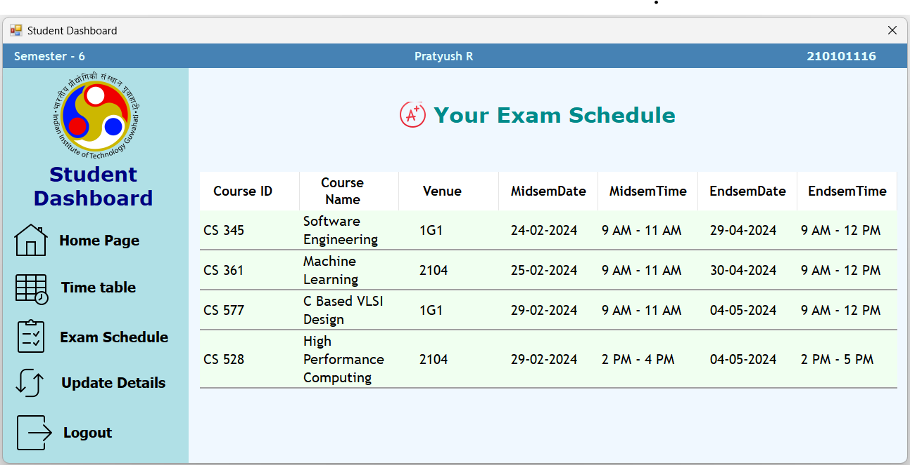

# Exam Schedule screen
This screen allows the Student to view the examination schedule of the mid-semester and end-semester examinations for the Courses they have currently opted for, along with the venue, date and time of the exams. 

## Usage Instructions

- The immediately visible screen, by default, will display the examination schedule as mentioned above.

[//]: # (Author: Pratyush R)
