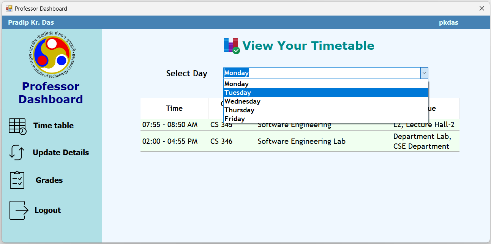
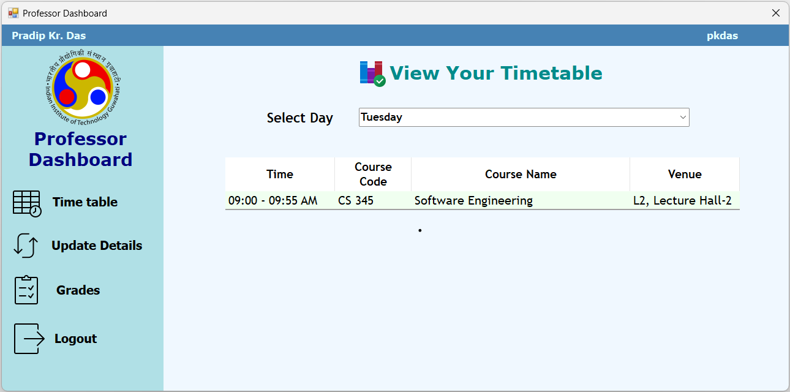

# Timetable screen
This screen allows the Faculty to view the day-wise schedule of the Courses they are currently teaching, which includes the respective time slot (in chronologically ascending order) and venues in addition to course information for a day.

## Usage Instructions

- The immediately visible screen, by default, will display the timetable for Monday.

- To see the timetable for other days, choose from the dropdown list provided. The appropriate timetable is then shown.

[//]: # (Author: Pratyush R)
