[// ---------------------Log In ----------------------------]: <> 
# Login Screen
This screen appears when user opens the application. Users can login into their respective account through this screen.

## Access Scope
- Any Student currently enrolled in an Undergraduate program of Computer Science and Engineering Department at Indian Institute of Technology, Guwahati
- Faculties, teaching courses to Computer Science students.
- Admin.

## Usage Instructions

- Initially, default login screen will be displayed.

- Then you need to select your role.

- Add your details and click the `Login` button
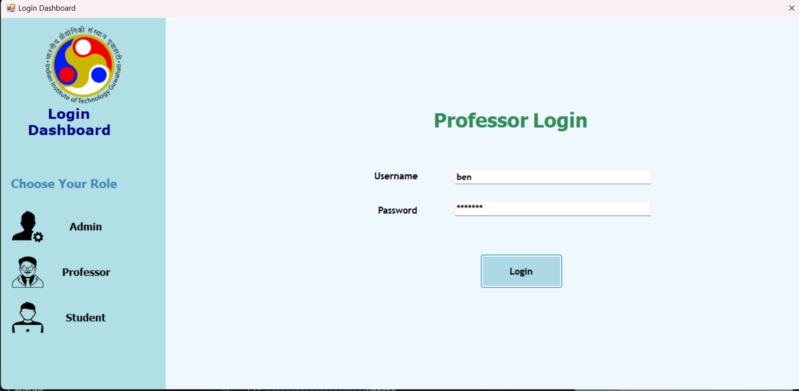
- You will be redirected to your homepage. Click on `Logout` button to go back to the login screen.
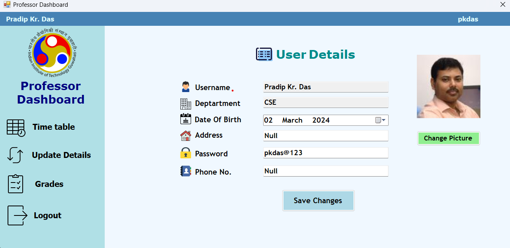

- If details are incorrect/left empty you will get an error message.
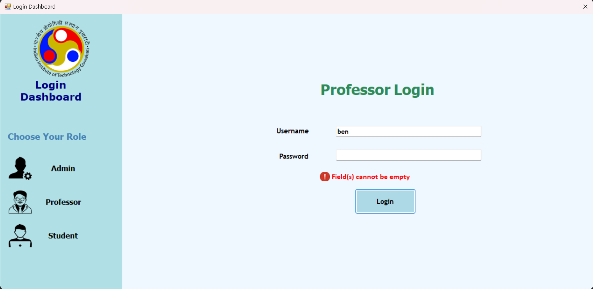
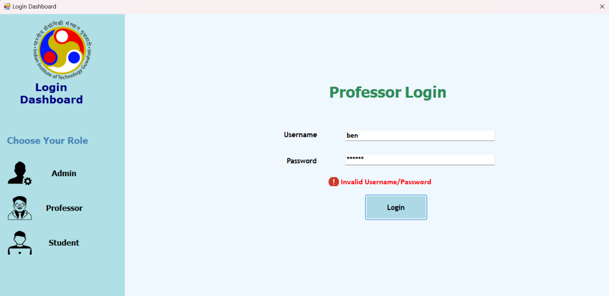  

> **NOTE:** 
Once the login button is clicked, the current form closes and new form ,User dashboard, will be opened. This might take some time.

[// ---------------------Update Details----------------------------]: <>

# Update Details Screen
This screen allows user (`student`/`professor`) to change their personal details.

## Usage Instructions

- This screen will display your personal details.

- To update your details, replace the corresponding field value with your new value and click on `Save Changes` button.
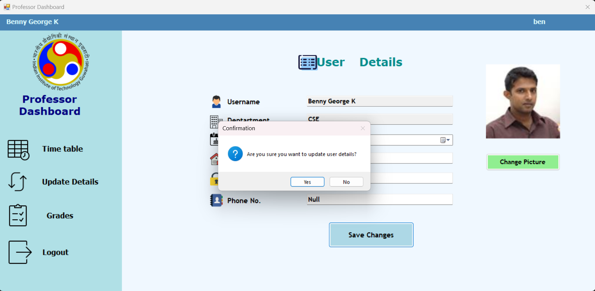

- To update your profile photo click on `Change Picture` browse and select new picture.
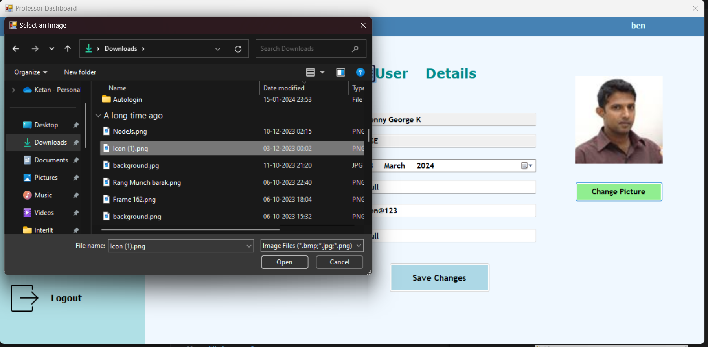
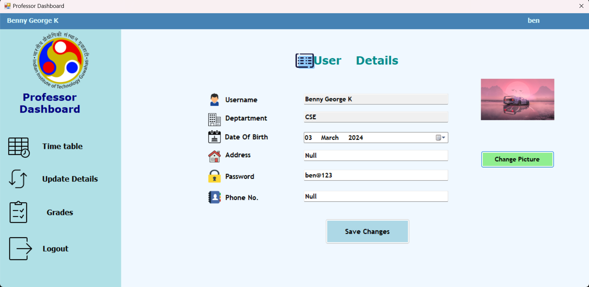

- You cannot keep an empty password / invalid phone number. 
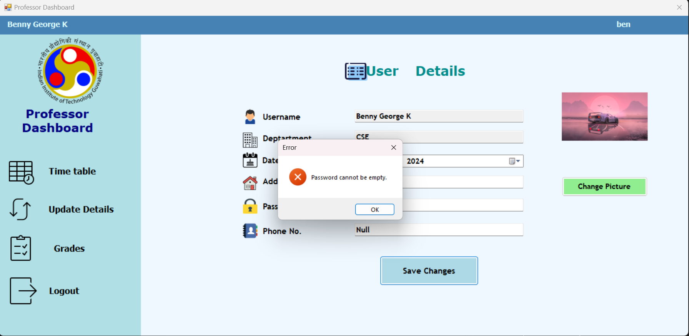
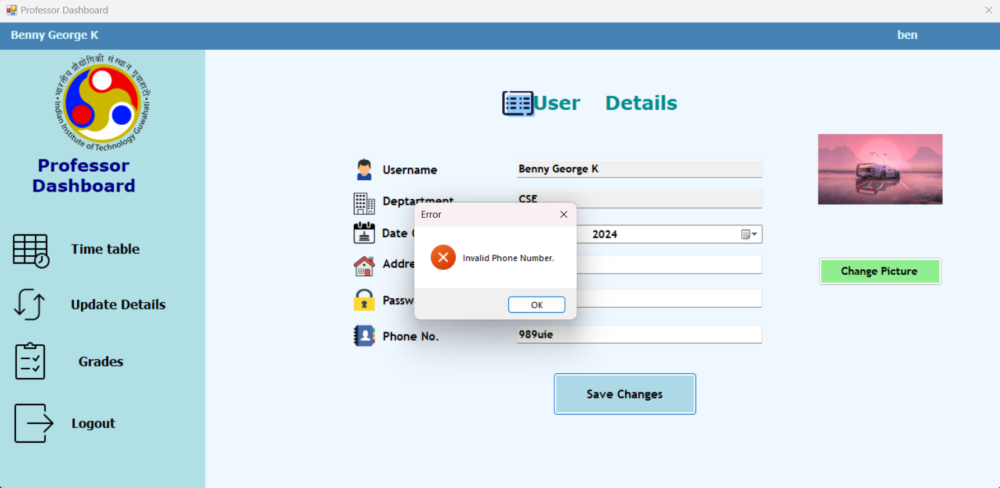

> **NOTE:** 
You cannot change your Username and Department.

[// ---------------------Prof Grade Screen----------------------------]: <>

# Prof Grades Screen
This screen provides the professor with the ability to access statistical data on course grades, upload grades for individual students enrolled in the course, and download grades for those students.

## Access Scope
Any Prof currently teaching at Indian Institute of Technology, Guwahati.

## Usage Instructions

- First screen.
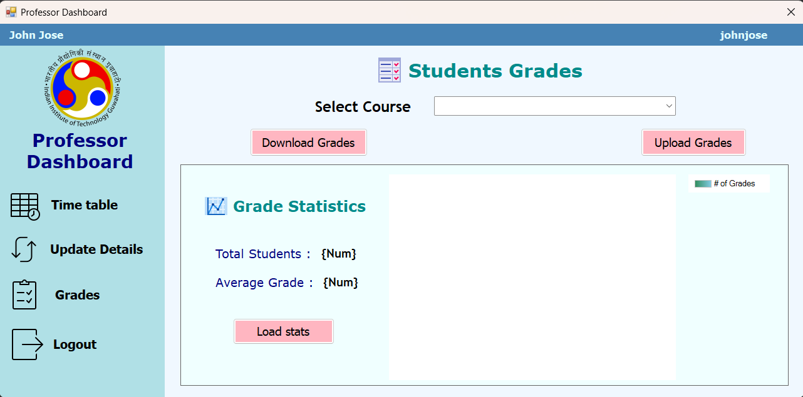

- Select a particular course taught by that professor from the dropdown list provided.
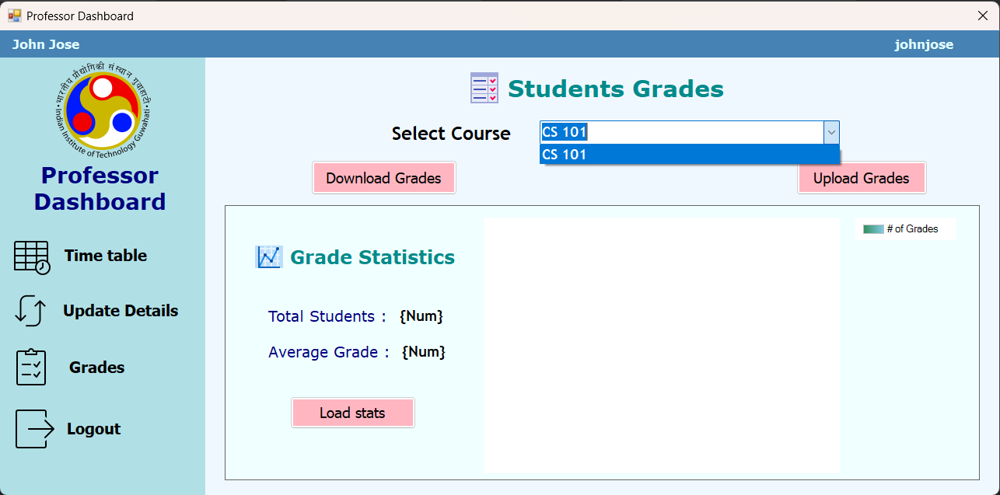

- For downloading a CSV file containing details of all students enrolled and their grades in the chosen course, click the 'Download Grades' button. The file will be saved in `...Academic-Management-System\Code\AcadSecManagementSystem\AcadSecManagementSystem`
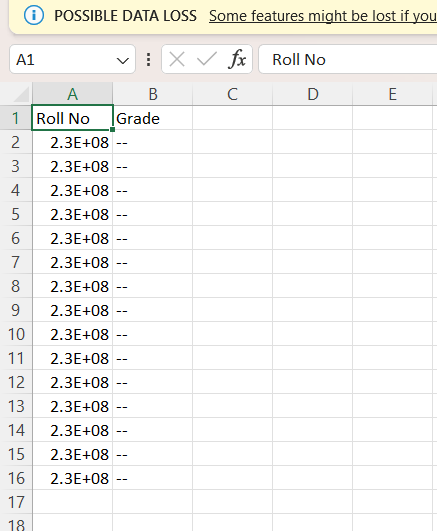

- For uploading a CSV file containing details of all students enrolled and their grades in the chosen course, click the 'Upload Grades' button and select that file.

- To load statistics of grades obtained by students, click the 'Load Stats' button.
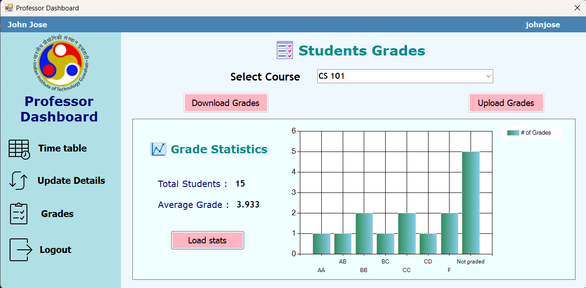

[// ---------------------Prof Time Table Screen----------------------------]: <>

# Time table screen
This screen allows the Faculty to view the day-wise schedule of the Courses they are currently teaching, which includes the respective time slot (in chronologically ascending order) and venues in addition to course information for a day.

## Usage Instructions

- The immediately visible screen, by default, will display the timetable for Monday.
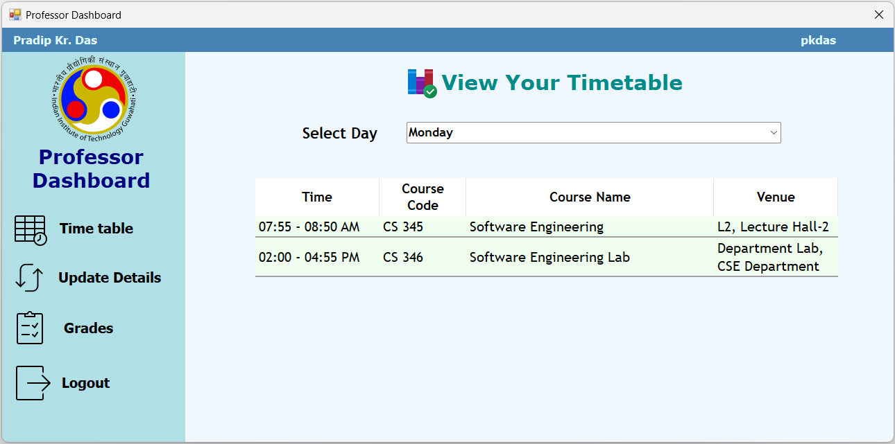

- To see the timetable for other days, choose from the dropdown list provided. The appropriate timetable is then shown.

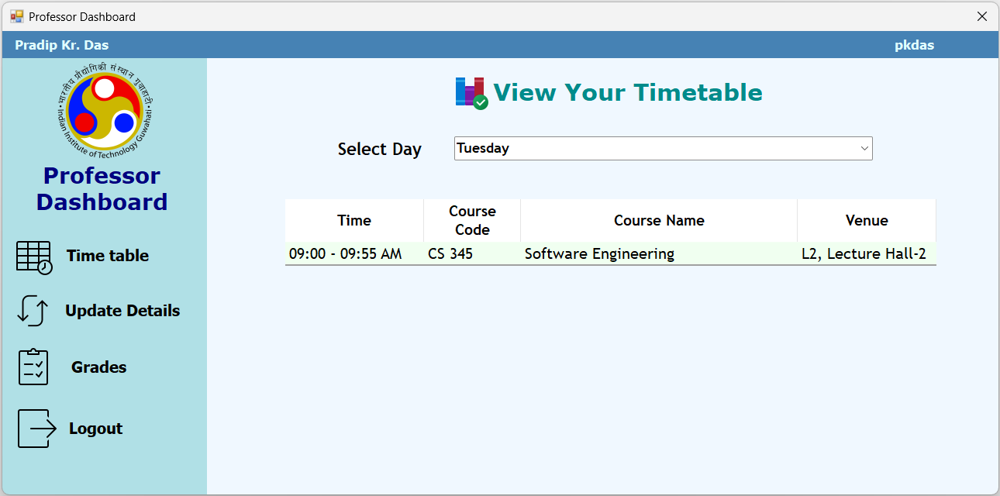

[//]: # (Author: Pratyush R)

>Note:Professor can navigate from `Update Details` to `Professor Time Table` screen only if admin has generated the course timetable.