[// ---------------------Log In ----------------------------]: <> 
# Login Screen
This screen appears when user opens the application. Users can login into their respective account through this screen.

## Access Scope
- Any Student currently enrolled in an Undergraduate program of Computer Science and Engineering Department at Indian Institute of Technology, Guwahati
- Faculties, teaching courses to Computer Science students.
- Admin.

## Usage Instructions

- Initially, default login screen will be displayed.

- Then you need to select your role.

- Add your details and click the `Login` button

- You will be redirected to your homepage. Click on `Logout` button to go back to the login screen.

- If details are incorrect/left empty you will get an error message.

  

> **NOTE:** 
Once the login button is clicked, the current form closes and new form ,User dashboard, will be opened. This might take some time.

[// ---------------------Student Homepage----------------------------]: <> 

# Student Homepage
This form displays the Registered Courses, Fee Payment and Course Registration Button for Student. They can view their Profile Picture also in this page.

## Access Scope : 
Any Student currently enrolled in an Undergraduate program of Computer Science and Engineering Department at Indian Institute of Technology, Guwahati.

## Usage Instructions

- This screen will display the details of the fees paid by the student. The details include the `semester`, `amount`, and `status` of the fees paid. 
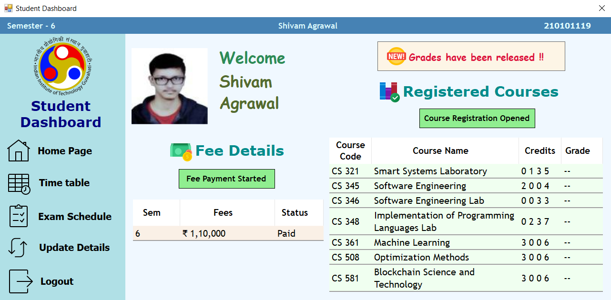

- You can pay your fees by clicking on the `Fee Payment Started` button. After you have paid the fees, a message box will appear confirming the payment. Click `OK` to close the message box.
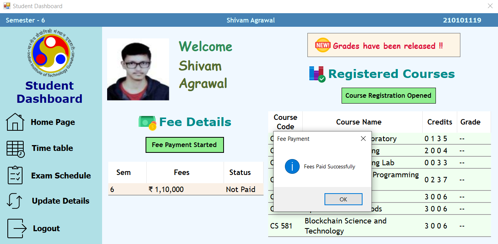

> **NOTE:**  
> You can only pay the fees after the Admin has started the fee collection. After the fee payment is done, the status of the fees paid will be updated as `Paid` in the table.

- You can also register for the courses by clicking the Course Registration Started button once Admin enables course registration.

- Once Professors have submitted their grades, you can view your grades for the subjects taken in that semester along with SPI.
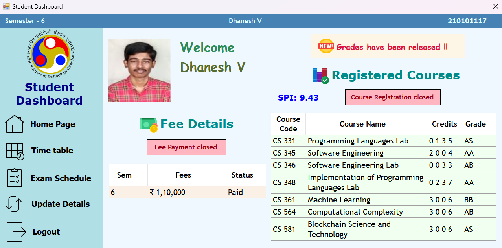

> **NOTE:**  
> If some professor hasnt uploaded your grade for a subject, the SPI will be shown as NA. Contact Academic Section in that case.

[// ---------------------Student Course Registration----------------------------]: <> 

# Student Course Registration Screen
This screen allows the Student to Register for Course or Electives according to IITG CSE syllabus.

## Access Scope
Any Student currently enrolled in an Undergraduate program of Computer Science and Engineering Department at Indian Institute of Technology, Guwahati.

## Usage Instructions

- This form will display all your compulsory courses as well as elective courses according to curriculum. Click on `Add` or `Drop` to Add this Course or Deregister to this course.
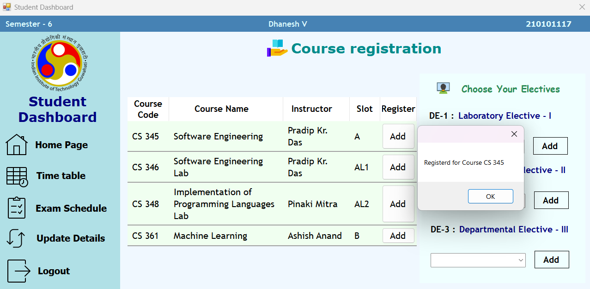

- If you have some electives (Lab or Theory), choose them from the combo box.

- If you belong to Fourth Year (8th Semester), you will have to choose only electives as there are no compulsory courses.

- If you belong to Second Year (6th Semester), you will have to register for all compulsory courses.
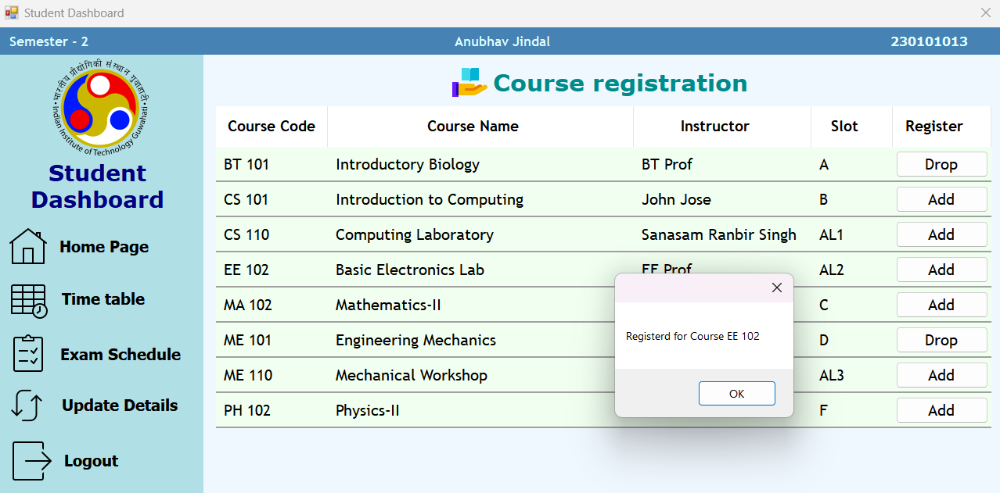

- If you belong to First Year (2nd Semester), you will have to register for all compulsory courses.

- Note that you can't add an elective if it clashes with the already choosen elective slot or compulsory courses. You will be prompted by the message box if you do so.
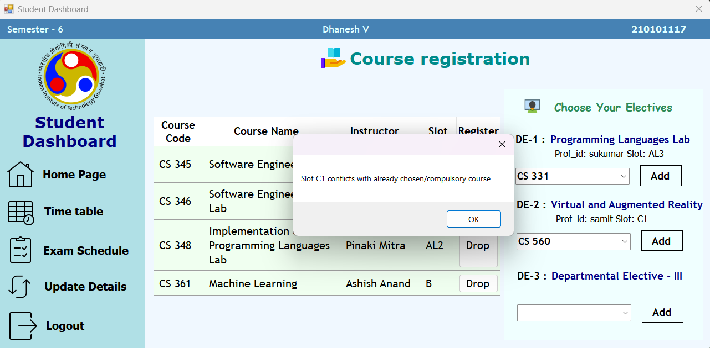

- Once done, you can safely navigate to any other forms as you wish.

> **NOTE:** 
You can navigate to this Form from `Student Home` Form only if you have paid your fees and the Admin has started the fee collection. Also, the form will clear your Courses Registration from DB if you visit again, so make sure to do all your changes before switching the tabs!

[// ---------------------Student Timetable----------------------------]: <> 

# Student Time Table screen
This screen allows the Student to view the day-wise schedule of the Courses they have currently opted for, which includes the respective time slot (in chronologically ascending order) and venues in addition to course information for a day.

## Usage Instructions

- The immediately visible screen, by default, will display the timetable for Monday.

- To see the timetable for other days, choose from the dropdown list provided. The appropriate timetable is then shown.
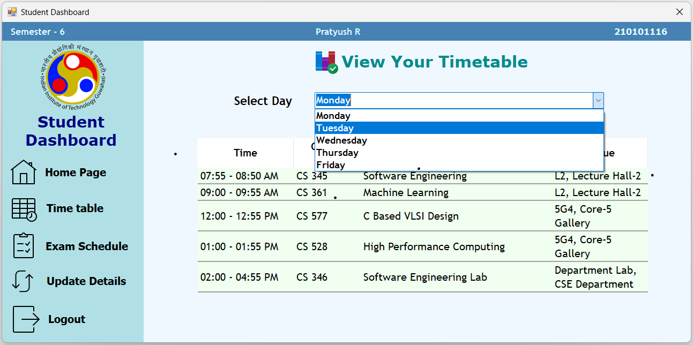
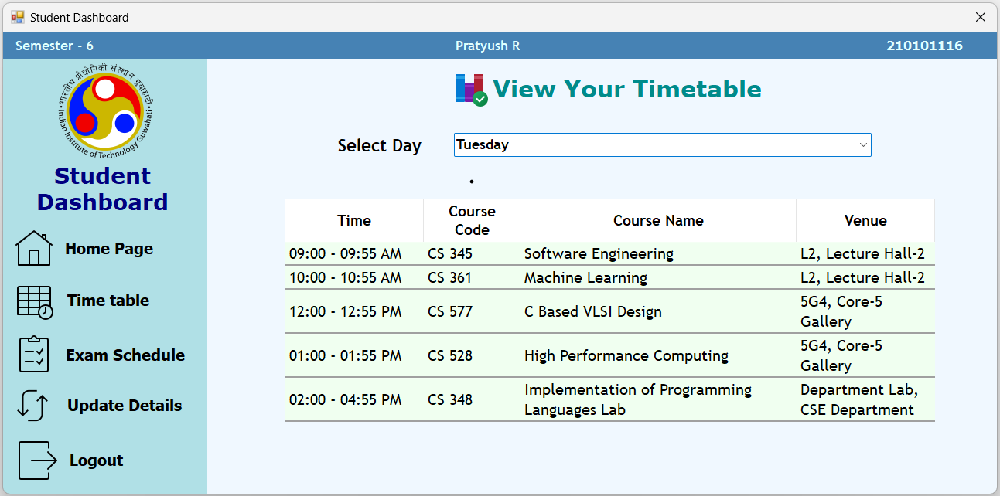

> **NOTE:** 
An empty timetable is **not necessarily** an indication of no scheduled courses on that day. In such a case, do **check** if your opted courses were actually saved or not.

[// ---------------------Exam Schedule Screen----------------------------]: <>

# Exam Schedule screen
This screen allows the Student to view the examination schedule of the mid-semester and end-semester examinations for the Courses they have currently opted for, along with the venue, date and time of the exams. 

## Usage Instructions

- The immediately visible screen, by default, will display the examination schedule as mentioned above.

>Note:Student can navigate from `Student Home` to `Student Exam Schedule` screen only if admin has set the midsem and endsem start date and student has paid the fees.

[// ---------------------Update Details----------------------------]: <>

# Update Details Screen
This screen allows user (`student`/`professor`) to change their personal details.

## Usage Instructions

- This screen will display your personal details.
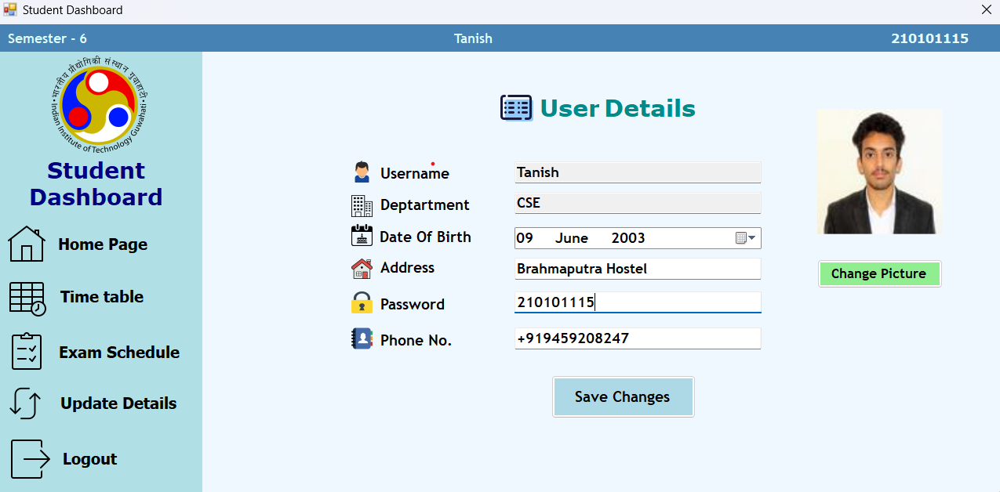

- To update your details, replace the corresponding field value with your new value and click on `Save Changes` button.

- To update your profile photo click on `Change Picture` browse and select new picture.

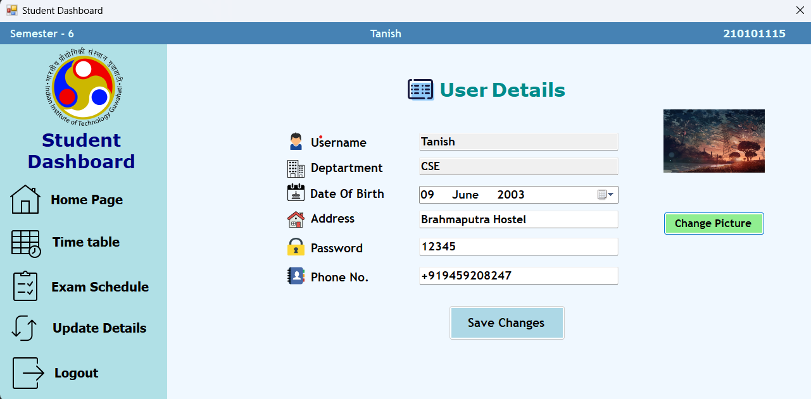

- You cannot keep an empty password / invalid phone number. 
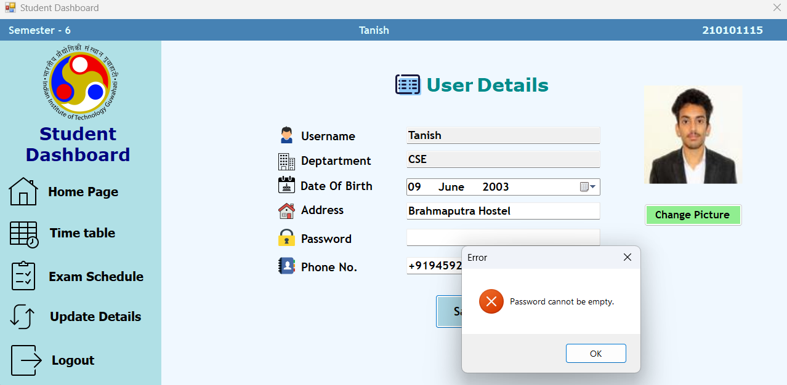

> **NOTE:** 
You cannot change your Username and Department.

